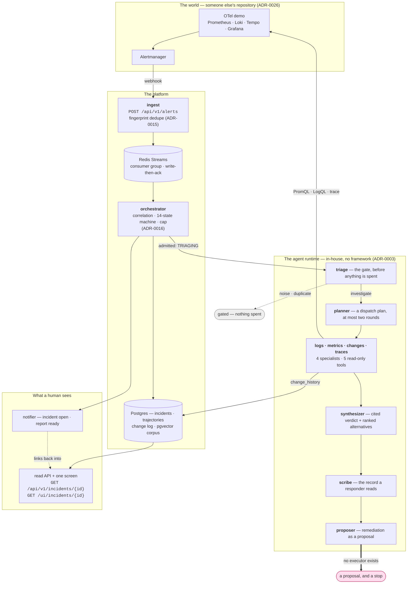
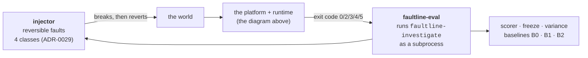

# Faultline Architecture

**This file records what is built.** The design intent lives in `docs/spec/`
(proposal rev 8, execution plan rev 9); this describes the tree as it stands, and the section
[What is not built](#what-is-not-built) is as load-bearing as the rest — a document that lists
only what exists reads as a document that lists everything.

Every decision below has an ADR. Where this file and an ADR disagree, the ADR is right and this
file has a bug.

---

## One investigation, end to end

**The notifier has two triggers and only one is drawn.** `Orchestrator._open` sends *incident
opened*, after the durable write; `faultline-investigate` sends *report ready* when a run finishes
— **on every outcome, not only on a verdict**, because a channel that only ever heard about
successes would teach a reader that the pipeline always succeeds, and would make *"the notifier is
broken"* and *"nothing was investigated today"* the same observation. The second edge is left out
of the diagram rather than drawn from a subgraph, where it read as though Postgres sent it.

**Every tool result crosses back into the runtime through one renderer** — delimited, typed and
labelled untrusted (`tools/envelope.py`). The two edges out of `spec` are the only paths from the
world into agent context, which is what makes that one renderer a boundary rather than a
convention.

**The thick edge out of the proposer is the point.** The pipeline ends at a proposal; nothing here
executes a remediation. [ADR-0028 §3](adr/0028-the-proposer-and-the-action-plane.md) argues that
one write tool would remove the runtime's safety property *by neighbourhood* rather than by name,
which is why the write path is absent rather than disabled.

### And the measurement loop, which is deliberately outside all of that

ADR-0004 keeps the harness outside the product: it drives the CLI and reads its **exit code**, and
no harness module imports the pipeline's internals. That is what makes the benchmark a benchmark
rather than a self-assessment — and it is why the exit codes below are a contract.

---

## What runs

Seven console entry points reach the product; the rest are the harness's.

| Command | What it is |
|---|---|
| `faultline-ingest` | the FastAPI app: `POST /api/v1/alerts`, `GET /healthz`, the read routes, and the UI |
| `faultline-orchestrate` | the consumer loop: read a batch, apply, ack after the durable write |
| `faultline-investigate` | one incident, end to end. Its **exit code is the contract** the harness uses |
| `faultline-migrate` | Alembic to head (ADR-0033) |
| `faultline-seed` | the service catalog and the past-incident corpus |
| `faultline-inject` | break the world on purpose, reversibly |
| `faultline-eval` and friends | scoring, judging, comparing, calibrating — `src/evalharness` |

`faultline-investigate`'s exit codes are four distinct outcomes, not a boolean, because a harness
that cannot tell *diagnosed* from *diagnosed with half its budget missing* from *never got a
verdict* will pool them:

| code | meaning |
|---|---|
| `0` | a verdict, nothing flagged |
| `2` | a verdict, **flagged** — budget exhausted, or a specialist that failed alone. Not an error |
| `3` | refused — no such incident, or one in a state the machine does not investigate |
| `4` | ran, produced no verdict; the trajectory is persisted up to the failure |
| `5` | **gated** — triage declined it before any specialist ran. Not a failure and not a refusal |

---

## The packages

| Path | What lives there | Arrived |
|---|---|---|
| `src/faultline/ingest` | webhook receiver, episode identity, Redis publish | T2.1 |
| `src/faultline/orchestrator` | correlation, the state machine, the cap, the consumer loop | T2.2–T2.3 |
| `src/faultline/context` | service catalog, dependency graph, past-incident corpus, allowlist | T2.4, T2.4b |
| `src/faultline/tools` | the five read tools, the trust envelope, window policy, change ranking | T2.6, T3.x |
| `src/faultline/agents` | the nine roles, contracts, trajectories, budget, the runner | T3.x |
| `src/faultline/api` | the incident view, its read routes, and the one screen | T5.1 |
| `src/faultline/notify` | incident-lifecycle notifications | T5.2 |
| `src/faultline/archive.py` | the evidence archive (ADR-0034) | T4.12 |
| `src/injector` | reversible fault injection, four classes | T1.4, T1.5 |
| `src/evalharness` | scenario runner, scoring, freeze, variance, judge, baselines | T4.x |

### The seams are Protocols, and that is what makes `make check` fast

`IncidentStore`, `TrajectoryStore`, `EventSource`, `CorrelationPolicy`, `LanguageModel`,
`Notifier` are all `typing.Protocol`. No Redis, no Postgres and no model client appears in the
orchestrator's or the agents' core logic, which is why the whole suite runs in under twenty
seconds with no Docker — and why the eight captured live alert events can be replayed through the
*real* consumer loop rather than through a reimplementation of it.

Integration tests that need real Postgres, Redis and MinIO exist and are **deselected by default**
(`make test-integration` opts in), so a clean clone with no Docker reports a pass rather than a
wall of skips that reads like a broken checkout.

---

## The tool surface — five tools, and nothing that writes

`faultline.tools.Tools` exposes exactly five public methods:

`promql_query` · `metric_baseline` · `logql_query` · `trace_query` · `change_history`

Three properties hold, and [ADR-0019 §4](adr/0019-tool-layer.md) is careful that the reason is
structural rather than credential-based — see [thesis 2 in the threat model](THREAT-MODEL.md),
which this repository's own ADR corrects:

1. **The tools expose query paths and no others.** Nothing constructs an arbitrary path from
   agent input.
2. **No tool takes a URL, a host or a path from an agent.** Endpoints come from configuration.
3. **`change_history` is read-only by construction** — the writer is the injector, and the tool
   has no write path to reach.

**Every result reaches an agent through one renderer** (`tools/envelope.py`): delimited, typed,
labelled untrusted, with the closing delimiter carrying the result's own random id, so a log line
reading `</tool_result>` cannot close a frame it cannot name. That defends the *parse*, not the
*judgement* — an agent that correctly identifies content as untrusted and believes it anyway is
thesis 1's residual, and belongs to T6.8.

**Adding a public method to `Tools` moves a frozen key.** `capability_version()` reads the tool
surface by introspection, so a new capability changes the eval harness's `world` fingerprint
automatically rather than by anybody remembering to bump a constant.

---

## The nine roles

`triage` · `planner` · `logs` · `metrics` · `changes` · `traces` · `synthesizer` · `scribe` ·
`proposer` — the tuple in `evalharness/freeze.py`, and the tuple `prompt_digest()` hashes.

| Role | What it decides | Refuses by |
|---|---|---|
| **triage** | investigate, duplicate, or noise — the gate before anything is spent | a validated `TriageJudgement`; severity and blast radius are *measured*, not asked, so a model cannot move a scored number |
| **planner** | which specialists, on which services, in which window | a validated `DispatchPlan`, at most two rounds |
| **logs · metrics · changes · traces** | what the evidence says, and what it rules out | findings must cite `result_id`s; a dispatch that fails validation twice is reported, never silent |
| **synthesizer** | the verdict: fault class, remediation class, **service**, ranked alternatives | citation validation — an id that resolves to nothing is a fabrication |
| **scribe** | the record a responder reads | the publication boundary: uncited claims are refused, regenerated once, then escalated |
| **proposer** | remediation as a *proposal* with risk notes | the allowlist (ADR-0032), the blast radius, and grounding |

**`prompt_digest()` hashes every `*_SYSTEM` string, `UNTRUSTED_RULE`, and the contracts' JSON
schemas.** Editing a prompt moves the digest, which moves the runtime version, which the freeze
refuses to pool across. That is the mechanism that stops a prompt edit quietly changing what a
published number means.

---

## The incident machine

Fourteen states (ADR-0016, Addendum 2): the eleven the specification names, plus `REJECTED`,
`BUDGET_EXHAUSTED` and `DUPLICATE_MERGED`, which the specification argues for two pages later and
which three rows of its own failure table needed in order to name anything.

**There is exactly one door into the agent lifecycle: `TRIAGING`.** That is the machine's answer
and not a choice — the transition table lets `PLANNING` be entered from `TRIAGING` and nowhere
else. An incident stranded past that door by a crashed run is deliberately *not* restartable;
`record_investigation_failure` moves it to `FAILED` first, and `FAILED` is terminal.

Three rules the state machine turns on:

- **An alert joining an incident already past `OPEN` does not restart triage.** It is recorded so
  the specialists see the full blast radius.
- **An incident resolves on the last resolution — an observable event, no timer.** The settle
  window governs *reopening* instead, so an incident's closing time depends on what the world did
  and not on when a periodic tick happened to run.
- **A resolution does not cancel an investigation in flight.** The fault is over; the question of
  what caused it is not, and that answer is what gets scored.

---

## The measurement side

The harness is **outside the product** (ADR-0004) and drives `faultline-investigate` as a
subprocess. Its exit code is the contract; no harness code imports the pipeline's internals.

**The freeze.** Seven keys — `runtime_version`, `prompts`, `corpus`, `model_map`, `budget`,
`judge`, `world` — and a run whose keys differ from a manifest's is a *different experiment*. The
harness refuses to pool them rather than averaging across them.

**Four runtimes are measured, not one.** The agent, plus three baselines that exist to answer
"compared to what":

| Runtime | What it is | What its gap measures |
|---|---|---|
| **B0** | no model at all — change-first heuristic over the change log | how much of the score is available without an LLM |
| **B1** | one model, all five tools, no fan-out, no retrieval, no proposer | decomposition **plus** retrieval **plus** the proposal step — a confound named rather than discovered |
| **B2** | the model's prior: alert text and service catalog, **no tools by signature** | how much is guessable without looking, and how often ids get invented |

B1 and B2 derive their digests from their own prompts, so they move automatically. B0's is a
manual `BASELINE_VERSION` because B0 has no prompt to hash.

**Scenarios: ten slots, 7 dev / 3 holdout, allocated before authoring** and by fault class and
index rather than by name, so no scenario could be routed to a convenient side (ADR-0008).
`SPLIT.md` is never edited to accommodate a scenario. Captured evidence — `evals/runs/`,
`evals/baselines/`, `docs/evidence/`, scenario artifacts — is never rewritten, which is why those
paths are excluded from the pre-commit hooks that would otherwise reformat a historical record.

---

## What is not built

Listed because a document that omits this is a brochure.

- **The action plane.** No executor, no approval service, no write credential anywhere. The
  proposer emits a proposal and the pipeline stops. ADR-0028 §3 argues that a single write tool
  would remove the runtime's safety property *by neighbourhood* rather than by name, and §4 leaves
  execution success as a reported-not-measured axis. **The action plane has no task number in the
  plan at all** — recorded in `docs/PLAN.md` under discovered omissions.
- **Authentication on any HTTP surface.** See [thesis 3](THREAT-MODEL.md).
- **Credentials on Prometheus and Loki.** Deferred to T6.8 explicitly; read-only is a property of
  the tool surface today, not of a credential.
- **Model substitution.** `Resilient` is a retry wrapper unless `fallback_models` is set, which it
  is not by default. ADR-0031 records what T2.5 never built.
- **A/A validation of the harness.** Built and invokable, and it needs R ≥ 2. Every sweep so far
  has been R = 1, so it cannot yet run on any data that exists.

---

## Decision log

Thirty-six ADRs. The ones to read first are marked ★.

| # | Decision |
|---|---|
| ★ [0001](adr/0001-redis-streams-over-kafka.md) | Redis Streams over Kafka for the event bus |
| [0002](adr/0002-pgvector-over-dedicated-vector-db.md) | pgvector over a dedicated vector database |
| ★ [0003](adr/0003-in-house-agent-runtime.md) | In-house agent runtime over an agent framework |
| ★ [0004](adr/0004-benchmark-target.md) | Benchmark target — SREGym primary, ITBench secondary |
| [0005](adr/0005-arm64-emulation-and-feature-flag-service.md) | Running the OTel demo on Apple Silicon |
| [0006](adr/0006-feature-flag-service-stub.md) | A native stub for the feature-flag service |
| [0007](adr/0007-chaos-injector-mechanisms.md) | How the injector breaks the world — and puts it back |
| ★ [0008](adr/0008-contamination-model.md) | Two-axis contamination model for the scenario catalog |
| [0009](adr/0009-rehearsal-artifact-bundle.md) | One recorded bundle per rehearsal, narrative written blind |
| [0010](adr/0010-injector-second-wave-faults.md) | A second wave of faults |
| [0011](adr/0011-target-name-validation.md) | Fault targets validated against the world's naming |
| [0012](adr/0012-alert-thresholds-and-headroom.md) | Alert thresholds, and the headroom on `ServiceHighLatency` |
| [0013](adr/0013-retiring-cpu-throttling.md) | Container CPU throttling is retired as a mechanism |
| [0014](adr/0014-bundle-schema-v2-world-digests.md) | Bundle schema v2 — content digests identify the world |
| ★ [0015](adr/0015-alert-ingest-identity-and-dedupe.md) | Alert identity, dedupe, and the ingest→orchestrator contract |
| ★ [0016](adr/0016-orchestrator-correlation-state-and-cap.md) | Correlation, the state machine, consumption, and the cap |
| [0017](adr/0017-context-layer-graph-and-dependency-policy.md) | The context layer — catalog, graph source, `DependencyPolicy` |
| [0018](adr/0018-past-incident-corpus.md) | The past-incident corpus — embeddings, quarantine, retrieval |
| ★ [0019](adr/0019-tool-layer.md) | The tool layer — contracts, trust labelling, credentials |
| ★ [0020](adr/0020-agent-layer.md) | The agent layer — the model, the nine roles, trajectories, budget |
| [0021](adr/0021-verdict-grounding-and-two-ended-truncation.md) | Verdict grounding and two-ended log truncation |
| ★ [0022](adr/0022-evaluation-harness.md) | The evaluation harness — what is scored, and how it is conducted |
| [0023](adr/0023-a-freeze-manifest-outlives-the-pipeline-it-froze.md) | A freeze manifest outlives the pipeline it froze |
| [0024](adr/0024-the-scale-class-and-what-this-world-can-show.md) | `scale` is a class this world cannot alert on |
| [0025](adr/0025-the-checkout-tail-and-where-not-to-fix-it.md) | The checkout-path latency tail is real |
| [0026](adr/0026-the-world-is-somebody-elses-repository.md) | The world clone is recorded by nothing |
| [0027](adr/0027-two-working-fixes.md) | `dependency_latency` has two working fixes |
| ★ [0028](adr/0028-the-proposer-and-the-action-plane.md) | The proposer, and what it would take to act |
| [0029](adr/0029-four-fault-classes-and-why-there-is-no-fifth.md) | Four fault classes, and why there is no fifth |
| [0030](adr/0030-the-dashboard-and-the-measurement-envelope.md) | The dashboard, and the edge of the measurement envelope |
| [0031](adr/0031-retries-substitutions-and-what-t2-5-never-built.md) | Retries, substitutions, and what T2.5 never built |
| [0032](adr/0032-the-allowlist-action-catalog.md) | The allowlist action catalog |
| [0033](adr/0033-migrations.md) | Migrations |
| [0034](adr/0034-the-evidence-archive.md) | The evidence archive |
| [0035](adr/0035-the-service-catalog.md) | The service catalog |
| [0036](adr/0036-what-may-be-written-in-a-runbook.md) | What may be written in a runbook |
