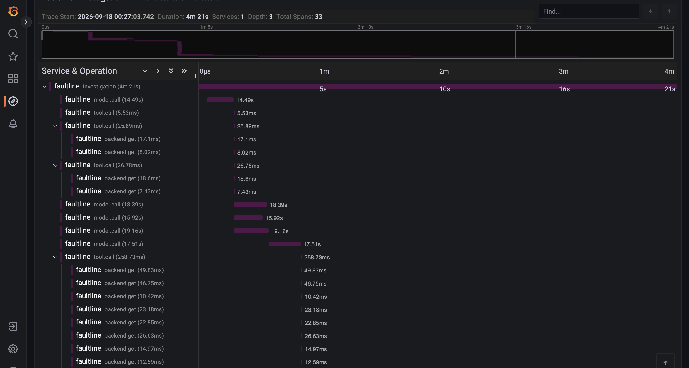

# The first trace — 2026-09-18

**Trace `e420efea2fe46357cc202aaf0a53802e`**, from a `--demo` run of `cart-dependency-latency`
launched with `OTEL_EXPORTER_OTLP_ENDPOINT` pointed at the world's collector on its published
host port. Excluded from every aggregate by `counts_toward_aggregates`, as a demo run is.
**$0.70.**

## What Tempo holds

| | |
|---|---|
| spans | **33** |
| root spans | **1** — `investigation`, 4m 21s |
| `model.call` | 10 |
| `tool.call` | 5 |
| `backend.get` | 17 |
| depth | 3 |
| services | 1 — `faultline`, `faultline.component = investigator` |

Read back through Tempo's HTTP API and rendered in Grafana against the provisioned `tempo`
datasource. One root means `tracing.propagate` did what it exists for: the specialist workers'
spans are children of the investigation rather than five fragments.

## What Postgres holds, joined

Trajectory `8ca5aa20…`, `trace_id = e420efea…`. **All 18 steps carry a span id.** The 7
completion steps map to 7 distinct spans and the 5 tool-call steps to 5 — the precise joins —
while message, retrieval, proposal and verdict share the root span, which is the coarse join
`Trajectory.add` provides. **7 of 7 completion steps carry non-zero latency, the slowest
33,088 ms** — the first model-call durations ever recorded in a trajectory.

## What the waterfall says that the trajectory could not

**The wall-clock is the model, not the world.** Every `model.call` is 14–19 seconds. Every
`tool.call` is single-digit to low-hundreds of milliseconds, with its `backend.get` children in
single-digit milliseconds beneath it. The four specialist `model.call` bars overlap at the
five-second mark — `_fan_out`'s thread pool, visible for the first time — and the investigation's
four minutes are almost entirely the agent waiting on its own model calls.

That is a statement about where the latency budget goes, and nothing before this could make it:
the trajectory recorded tool-call latency and zero for every model call.

## Two things learned getting here

**`configure()` existed and nothing called it** — piece 2 forgot the entry points, and no test
could see it because a library that is inert until its process opts in is exactly the shape
`make check` cannot exercise. Piece 2b.

**Grafana asks Tempo with the time picker's range attached.** A `curl` to `/api/traces/{id}`
found the trace; Grafana's TraceID query said *404 trace not found* until the range was widened
past the run's start. Worth knowing before the dashboard's trace panel is built.
